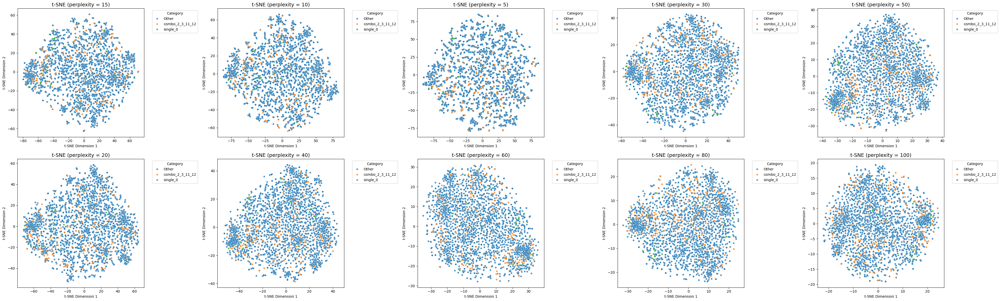
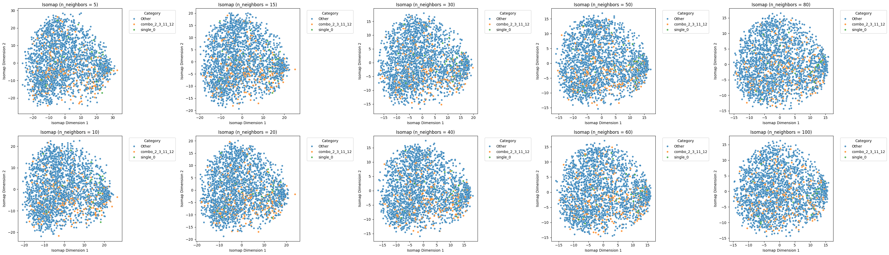

# DA5401: Assignment 5 — Manifold Visualization

## Student Details

* **Name:** Chirag
* **Roll Number:** DA25M008

---

## 📌 Assignment Overview

This project focuses on exploring **data veracity challenges** in multi-label classification using the **Yeast dataset**.
The assignment applies **t-SNE** and **Isomap** for manifold visualization to uncover:

* **Noisy / Ambiguous Labels** – genes spanning multiple categories or misclassified.
* **Outliers** – unusual gene expression profiles.
* **Hard-to-Learn Samples** – overlapping functional categories that confuse classifiers.

The goal is to **visually identify these challenges** and understand how they impact classification difficulty.

---

## ⚙️ Methodology

1. **Dataset & Preprocessing**

   * Dataset: Yeast gene expression (103 features, 14 functional categories).
   * Label simplification: Reduced to two most frequent single-labels, one frequent multi-label, and “Other”.
   * Standardization: Features scaled to zero mean and unit variance for distance-based methods.

2. **Dimensionality Reduction & Visualization**

   * **t-SNE**: Experimented with multiple perplexity values (5, 30, 50).

     * Final choice balanced local cluster preservation and interpretability.
   * **Isomap**: Applied with chosen neighborhood size to capture **global structure** of data.
   * Scatter plots created with simplified categories as colors.

3. **Veracity Inspection**

   * **Noisy/Ambiguous Labels**: Points embedded in clusters of different colors.
   * **Outliers**: Isolated points / mini-clusters far from the main distribution.
   * **Hard-to-Learn Samples**: Overlapping regions where categories are inseparable.

4. **Comparison of Techniques**

   * **t-SNE** preserves **local neighborhood structure** → better at highlighting anomalies.
   * **Isomap** preserves **global manifold structure** → better for understanding overall geometry.

---

## 📊 Results Summary

### t-SNE

* Clear clusters formed for dominant categories.
* Mixed-color regions highlighted ambiguous and hard-to-learn samples.
* Outliers distinctly separated from clusters.

### Isomap

* Showed the **global curvature** of the gene expression manifold.
* Suggested that the manifold is **highly complex**, which explains classification challenges.
* Compared to t-SNE, Isomap sacrifices some local detail but emphasizes large-scale structure.

---

## ✅ Conclusion

* **t-SNE** excels in finding **local anomalies** (noisy labels, mixed clusters).
* **Isomap** highlights the **global manifold** and its complexity.
* Together, they provide complementary insights into data veracity challenges.
* Visualizations confirm that classification is difficult due to overlapping functional categories and irregular data distribution.

---

## 📸 Visualizations

### t-SNE Plot Collage

### Isomap Plot Collage

---
